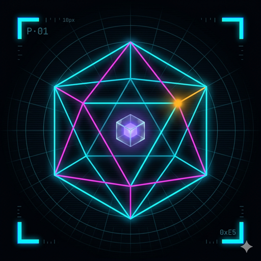

<div align="center">



# Sim World

#### _A phased simulation of organic life — rendered as a Palantir-style HUD._

[](https://react.dev/)
[](https://www.typescriptlang.org/)
[](https://vitejs.dev/)
[](https://eslint.org/)
[](#license)
[](https://noeosorio.com)

[**Live demo**](https://simulations.noeosorio.com) &nbsp;·&nbsp;
[**Phase 01 — Micro Ecosystem**](src/simulations/micro-ecosystem/README.md) &nbsp;·&nbsp;
[**Phase 02 — Skill Ecosystem**](src/simulations/skill-ecosystem/README.md) &nbsp;·&nbsp;
[**Phase 03 — Tribal Society**](src/simulations/tribal-society/README.md)

</div>

---

## ▌ What is this?

**Sim World** is a single-page app that hosts a growing series of **self-contained simulations**, each one modelling a _phase_ in the history of organic life. Start with single-cell creatures in a primordial soup, end somewhere far stranger. Every phase ships as its own folder and plugs into the shell through one registry entry.

The UI is a dark, Palantir-inspired HUD: neon cyan / magenta / amber accents, mono-typography, corner brackets, and a faint grid backdrop.

```text
phase 01 ──●───● phase 02 ──●───● phase 03 ──◌───◌ phase 04 (coming soon)
```

---

## ▌ Phases

| # | Phase | What it models | Status |
|---|-------|----------------|--------|
| **01** | [**Micro Ecosystem**](src/simulations/micro-ecosystem/) | Tiny creatures wander, eat, and reproduce. First spark of organic life. |  |
| **02** | [**Skill Ecosystem**](src/simulations/skill-ecosystem/) | Four roles — farmer, harvester, healer, builder — with inheritable skills. |  |
| **03** | [**Tribal Society**](src/simulations/tribal-society/) | Nobody is self-sufficient. Ages, teachers, and role-learning. |  |
| **04** | Predator & Prey | First food chains, senses, survival pressure. |  |

> Each simulation folder contains a plain-English `README.md` describing what that phase models.

---

## ▌ Quick start

```bash
# clone
git clone git@github.com:NoeOsorio/simulations.git
cd simulations

# run
npm install
npm run dev          # http://localhost:5173
```

Production build:

```bash
npm run build        # tsc -b && vite build
npm run preview      # serve the production build
```

Lint:

```bash
npm run lint
```

---

## ▌ Tech stack

| Layer | Choice | Why |
|-------|--------|-----|
| Framework | **React 19** | Fine-grained control over refs for high-FPS canvas loops. |
| Build | **Vite 8** | Instant HMR, static build, hash-router friendly. |
| Language | **TypeScript 6** | Strict types across shared registry and persistence. |
| Routing | **React Router 7** (`HashRouter`) | Works from `file://` and any static host — no server rewrites. |
| Rendering | **HTML5 Canvas** | Each simulation picks its own (canvas / SVG / DOM); canvas for the current phases. |
| Persistence | **Plain text files** | No backend. Saves and logs download straight from the browser. |

---

## ▌ Project structure

```
simulations/
├── public/
│   ├── logo.png                    ← Sim World icon (this repo)
│   ├── og-image.png                ← social-share image
│   └── site.webmanifest            ← PWA manifest
├── src/
│   ├── App.tsx                     ← shell + top-nav + router
│   ├── index.css                   ← Palantir HUD design tokens
│   ├── components/
│   │   └── MainMenu.tsx            ← landing page with phase cards
│   ├── lib/
│   │   └── persistence.ts          ← shared text-file save/load
│   └── simulations/
│       ├── registry.ts             ← list of all simulations (drives the menu)
│       ├── micro-ecosystem/        ← Phase 01
│       ├── skill-ecosystem/        ← Phase 02
│       └── tribal-society/         ← Phase 03
├── index.html                      ← SEO, OG, Twitter Card, JSON-LD
├── CLAUDE.md                       ← repo rules (frozen phases, etc.)
└── README.md                       ← you are here
```

---

## ▌ Persistence — logs & state

Every simulation can emit two kinds of plain-text files (downloaded straight from the browser):

1. **Event logs** — `sim-<phase>-logs-YYYYMMDD-HHMMSS.txt`
   A timestamped list of every event in the run (births, deaths, food rains, etc.).

2. **Saved state** — `sim-<phase>-state-YYYYMMDD-HHMMSS.txt`
   A `#`-commented header followed by a JSON snapshot. Re-loadable from the same simulation page via **Load state**.

Shared helpers live in [`src/lib/persistence.ts`](src/lib/persistence.ts):

- `downloadText(filename, content)` — trigger a file download
- `pickTextFile()` — open the system picker and return the file's text
- `logsToText(header, entries)` — format an event log as text
- `stateToText(label, state)` / `parseStateText(text)` — round-trip simulation state

Saved-state files are versioned (`version: 1`); simulations reject older versions so the format can evolve safely.

<details>
<summary>Example saved-state file</summary>

```text
# sim-world state · micro-ecosystem · 2026-04-23T01:42:11.039Z
{
  "version": 1,
  "savedAt": "2026-04-23T01:42:11.039Z",
  "tick": 4218,
  "stats": { "born": 12, "died": 4, "totalEaten": 87 },
  "creatures": [ ... ],
  "food": [ ... ]
}
```

</details>

---

## ▌ Adding a new phase

1. Create `src/simulations/<my-phase>/` with at minimum:
   - `README.md` — short, plain-English description.
   - A React component that renders the simulation.

2. Append a `SimulationMeta` entry in [`src/simulations/registry.ts`](src/simulations/registry.ts):

   ```ts
   {
     id: 'my-phase',
     phase: 4,
     title: 'Phase 4 — My Phase',
     shortTitle: 'My Phase',
     tagline: 'One-line hook.',
     description: 'A few sentences for the menu card.',
     icon: '🧪',
     path: '/my-phase',
     status: 'available',
     Component: MyPhase,
   }
   ```

3. Done — the card and route appear automatically.

> ⚠️ **Frozen phases.** Once a phase ships, its files are frozen. See [`CLAUDE.md`](CLAUDE.md) for the exact rules on what you can and can't touch.

---

## ▌ Design system

- **Palantir HUD** — deep void background, cyan / magenta / amber / lime neon accents, JetBrains Mono for tabular data, Inter for prose.
- **Corner brackets** (`.brackets`) frame any `.hud` panel.
- **`.hud`** and **`.hud--solid`** are the two panel primitives — translucent over the grid or fully opaque.
- **`.btn`** comes in `--primary`, `--magenta`, `--ghost`, and `--danger` variants.
- **`.chip`** for status tags (`--cyan`, `--magenta`, `--amber`, `--lime`, `--muted`).
- No text-decoration underlines anywhere — hover cues are color, glow, and transform.

Tokens live on `:root` in [`src/index.css`](src/index.css).

---

## ▌ Roadmap

- [x] Phase 01 — Micro Ecosystem
- [x] Phase 02 — Skill Ecosystem
- [x] Phase 03 — Tribal Society
- [ ] Phase 04 — Predator & Prey
- [ ] Phase 05 — Language & Myth
- [ ] Phase 06 — City-State
- [ ] Phase N — …

---

## ▌ Author

<div align="center">

**Noe Osorio** — Software Engineer

[](https://noeosorio.com)
[](mailto:business@noeosorio.com)
[](https://github.com/NoeOsorio)

</div>

---

## ▌ License

Released under the [MIT License](LICENSE). Free to fork, remix, and build new phases on top of.

<div align="center">
<sub>Built with neon ◆ by <a href="https://noeosorio.com">Noe Osorio</a></sub>
</div>
