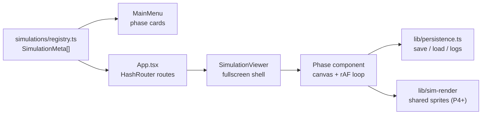

<div align="center">

<!-- TODO: create docs/banner-dark.png and docs/banner-light.png (1280x640) using the noeosorio.com palette (background #18181b, accent #bef264 → #10b981), then uncomment
<picture>
  <source media="(prefers-color-scheme: dark)" srcset="docs/banner-dark.png">
  
</picture>
-->


# Sim World

**Watch organic life evolve in your browser, one phase at a time: from a primordial soup to families with personalities.**


[**Live demo**](https://simulations.noeosorio.com) · [Add a phase](docs/how-to-add-a-simulation.md) · [Report a bug](../../issues)

</div>

**Sim World** is a single-page app that hosts a growing series of **self-contained simulations**, each one modelling a _phase_ in the history of organic life. Every phase adds one new pressure (scarce food, interdependence, family) and ships as its own folder that plugs into the shell through a single registry entry. No backend: runs, logs and saves live entirely in the browser.

<sub>[Features](#-features) · [Demo](#️-demo) · [Quickstart](#-quickstart) · [Configuration](#️-configuration) · [Architecture](#️-architecture) · [Structure](#-structure) · [Roadmap](#️-roadmap) · [License](#-license)</sub>

## ✨ Features

| # | Phase | What it models |
|---|-------|----------------|
| 01 | 🧬 [**Micro Ecosystem**](src/simulations/micro-ecosystem/README.md) | Tiny creatures wander, eat, mate when they have enough energy, and die when they run out. |
| 02 | 🛠️ [**Skill Ecosystem**](src/simulations/skill-ecosystem/README.md) | Food stops being free. Farmers, harvesters, healers and builders with inheritable, mutating skills. |
| 03 | 🏘️ [**Tribal Society**](src/simulations/tribal-society/README.md) | Nobody is self-sufficient. Five interdependent roles, life stages, teachers and old age. |
| 04 | 🏠 [**Family Bonds**](src/simulations/family-bonds/README.md) | Inheritable personalities, lifelong partners, family houses and pantries, schools and barter. |

Across every phase:

- **Save and reload runs** as plain-text files (`#` header + versioned JSON), straight from the browser.
- **Export event logs**: births, deaths, food and every other event, timestamped.
- **Speed controls and fullscreen viewer** on top of a high-FPS canvas loop.
- **Static-host friendly**: `HashRouter` means the build works from `file://` or any static host with no rewrites.

## 🖼️ Demo

<div align="center">

[](https://simulations.noeosorio.com)

</div>

<!-- TODO: add docs/demo.gif showing a Family Bonds run -->

Try it live at **[simulations.noeosorio.com](https://simulations.noeosorio.com)**.

## 🚀 Quickstart

**Requirements:** Node >= 20.19 (or >= 22.12 on the 22.x line), as required by Vite 8, and npm.

```bash
git clone https://github.com/NoeOsorio/simulations.git
cd simulations
npm install
npm run dev          # http://localhost:5173
```

> [!NOTE]
> The dev server runs React StrictMode and is noticeably slower than production. Use `npm run build && npm run preview` to judge real performance.

| Command | What it does |
|---|---|
| `npm run dev` | Start the Vite dev server with HMR |
| `npm run build` | Type-check (`tsc -b`) and build to `dist/` |
| `npm run preview` | Serve the production build locally |
| `npm run lint` | Run ESLint |

There is no test runner configured yet; `npm run build` is the type-safety gate.

## ⚙️ Configuration

No environment variables or services are needed. Everything runs client-side.

<details>
<summary>Save and log file format</summary>

Each simulation downloads two kinds of plain-text files:

1. **Event logs**: `sim-<phase>-logs-YYYYMMDD-HHMMSS.txt`, one timestamped event per line.
2. **Saved state**: `sim-<phase>-state-YYYYMMDD-HHMMSS.txt`, a `#`-commented header followed by a JSON snapshot, reloadable via **Load state** on the same simulation page.

Saved-state files are versioned (`version: 1`) and simulations reject other versions, so the format can evolve safely.

```text
# sim-world state · micro-ecosystem · 2026-04-23T01:42:11.039Z
{
  "version": 1,
  "savedAt": "2026-04-23T01:42:11.039Z",
  "tick": 4218,
  "stats": { "born": 12, "died": 4, "totalEaten": 87 },
  "creatures": [ ... ],
  "food": [ ... ]
}
```

Helpers live in [`src/lib/persistence.ts`](src/lib/persistence.ts): `downloadText`, `pickTextFile`, `logsToText`, `stateToText` / `parseStateText`.

</details>

## 🏗️ Architecture

A single registry drives both the main menu and the router, so adding a phase never touches routing code.


```mermaid
flowchart LR
    R["simulations/registry.ts<br/>SimulationMeta[]"] --> M["MainMenu<br/>phase cards"]
    R --> A["App.tsx<br/>HashRouter routes"]
    A --> V["SimulationViewer<br/>fullscreen shell"]
    V --> P["Phase component<br/>canvas + rAF loop"]
    P --> L["lib/persistence.ts<br/>save / load / logs"]
    P --> S["lib/sim-render<br/>shared sprites (P4+)"]
```

Each phase keeps per-frame state in refs, pre-renders static backdrops to an offscreen canvas, and only pushes throttled stats into React state.

<details>
<summary>Adding a new phase</summary>

1. Create `src/simulations/<phase-id>/` with a default-exported `<Phase>.tsx` and a plain-English `README.md`.
2. Append a `SimulationMeta` entry to [`src/simulations/registry.ts`](src/simulations/registry.ts):

   ```ts
   {
     id: 'my-phase',
     phase: 5,
     title: 'Phase 5 — My Phase',
     shortTitle: 'My Phase',
     tagline: 'One-line hook.',
     description: 'A few sentences for the menu card.',
     icon: '🧪',
     path: '/my-phase',
     status: 'available',
     Component: MyPhase,
   }
   ```

3. The menu card and route appear automatically.

> [!WARNING]
> **Shipped phases are frozen.** When building a new phase, never edit earlier phases' files; duplicate what you need instead. See [`CLAUDE.md`](CLAUDE.md) and the full checklist in [`docs/how-to-add-a-simulation.md`](docs/how-to-add-a-simulation.md).

</details>

## 📁 Structure

<details>
<summary>View structure</summary>

```text
simulations/
├── docs/
│   └── how-to-add-a-simulation.md   # checklist for new phases
├── public/                          # logo, favicons, og-image, PWA manifest
├── src/
│   ├── App.tsx                      # shell: top nav + hash router
│   ├── components/
│   │   ├── MainMenu.tsx             # landing page with phase cards
│   │   └── SimulationViewer.tsx     # fullscreen-capable viewer
│   ├── lib/
│   │   ├── persistence.ts           # shared text-file save/load
│   │   ├── sim-math.ts, sim-names.ts, sim-types.ts
│   │   └── sim-render/              # shared canvas sprites (P4+)
│   ├── styles/                      # HUD design tokens and layout
│   └── simulations/
│       ├── registry.ts              # drives menu + routes
│       ├── micro-ecosystem/         # Phase 01
│       ├── skill-ecosystem/         # Phase 02
│       ├── tribal-society/          # Phase 03
│       └── family-bonds/            # Phase 04
├── index.html                       # SEO, Open Graph, JSON-LD
└── CLAUDE.md                        # repo rules (frozen phases, conventions)
```

</details>

## 🗺️ Roadmap

- [x] Phase 01 — Micro Ecosystem
- [x] Phase 02 — Skill Ecosystem
- [x] Phase 03 — Tribal Society
- [x] Phase 04 — Family Bonds
- [ ] Phase 05 — coming soon
- [ ] Test runner and CI

## 📄 License

Distributed under the MIT License. See [`LICENSE`](LICENSE).

---

<div align="center">

Made with ☕ by [Noé Osorio](https://noeosorio.com) · [business@noeosorio.com](mailto:business@noeosorio.com)

</div>
